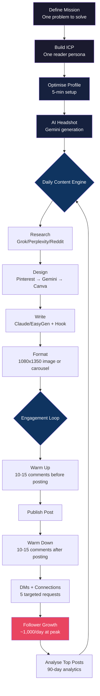

# The 10K LinkedIn Growth Engine — Playbook

> Reverse-engineered from Ruben Hassid's system (770K+ followers, 5 accounts, 1.56M combined)
> Documented case: Maria Zhanette — 49 → 10,000 followers in 17 days

---

## 1. System Overview

This is a sequential growth engine with three layers: Foundation (set up once), Content Engine (daily), and Engagement Loop (daily). The system compounds — each layer amplifies the next.

**The formula**: Mission + ICP → Content (Solution + Angle + Format) → Engagement (Warm-up + Post + Warm-down) → Followers → Data → Better Content

**Core philosophy**: Write for one reader, never about yourself. AI accelerates execution but requires human judgment, taste, and daily consistency.



---

## 2. Foundation Layer (Do Once)

### 2.1 Profile Optimisation Checklist

Complete all items before publishing your first post.

- [ ] **Profile Picture**: 1080x1080 px, zoomed face, smiling, own a distinct colour. Use AI generation (see 2.2).
- [ ] **Banner**: 1584x396 px, single clear message reinforcing your mission. Premium enables slideshow.
- [ ] **Headline**: Cheeky and clear. Mission-driven, not job-title-driven. Examples: "Master AI before it masters you" / "Helping solopreneurs escape the 9-5 with AI"
- [ ] **Featured Section**: One link, big text, no descriptions. Direct clicks only.
- [ ] **About Section**: Minimal. Don't write an essay — experience sections rank higher in search.
- [ ] **LinkedIn Premium**: Consider upgrading for the link under your name (conversion boost).
- [ ] **Verify**: Open your profile in an incognito browser. In 3 seconds, can a stranger answer: "What does this person do and why should I follow them?" If not, revise.

*Source: Topics 1, 3*

### 2.2 AI Headshot Generation Workflow

1. Select a clear personal photo (good lighting, face visible).
2. Browse LinkedIn for a headshot style you admire. Screenshot it.
3. Open Google Gemini.
4. Upload both images.
5. Prompt: **"Generate a corporate headshot of my image in [describe your clothing] in the same style as the 2nd image I uploaded as inspiration"**
6. Download result.
7. **Remove AI metadata**: Use aimetadatacleaner.com OR take a screenshot of the result.
8. Crop to 1080x1080 px in Canva.
9. Upload to LinkedIn.

*Source: Topic 2*

### 2.3 Mission Statement Creation (GPT Workflow)

Your mission is the single problem you solve. Everything flows from this.

1. Go to: chatgpt.com/g/g-67530e1fbcbc819186a9cae1fc734cfe-mission-gpt
2. Answer the GPT's clarifying questions.
3. Output: a one-sentence mission statement.
4. **Validation test**: Does it describe ONE problem, not a list of services? Can you explain it to a stranger in 10 seconds?

**Reference missions:**
| Creator | Mission |
|---------|---------|
| Ruben Hassid | "How to AI with English, not code" |
| Justin Welsh | "Run a solopreneur business without ruining your life" |
| Codie Sanchez | "Own a small, profitable business" |

*Source: Topic 3*

### 2.4 ICP Definition (GPT Workflow)

1. Go to: chatgpt.com/g/g-89NEaQgUI-icp-gpt
2. Answer the guided questions.
3. Output: a detailed persona with name, age, role, location, struggle, aspiration.
4. Save this persona. Reference it before every post.

**Example ICP:**
> Sophia, 40, female, independent management consultant in Europe. Wants to position herself as an AI-upskilling expert but doesn't know where to start. Feels overwhelmed by the pace of AI change. Needs clear, jargon-free guidance she can implement immediately.

**The test**: Before every post, ask — "Would Sophia stop scrolling for this?"

*Source: Topics 4, 6*

---

## 3. Content Engine (Daily/Weekly Cadence)

### 3.1 The #1 Content Rule

**Write for your reader. Never about yourself.**

- Every post must be about the reader's problem, not your achievement.
- "I (still) never write a personal post. I know no one cares about me."
- Test: remove your name from the post. Is it still valuable? If not, rewrite.
- Frame your expertise as solutions to their problems, not credentials.

**Claude prompt for content angle development:**
```text
Find the best angle/topic for one LinkedIn post that turns my expertise
into something useful, relatable, and 100% about the reader — not
bragging — by asking clarifying questions about real problems my
audience struggles with, what expertise feels most useful to strangers,
and how to frame it so readers see themselves.
```

*Source: Topic 5*

### 3.2 Content Creation Formula

Every post follows: **Mission + Solution + Angle + Format**

- **Mission**: The one problem you solve (from 2.3)
- **Solution**: One specific answer to one specific sub-problem
- **Angle**: The unique framing (contradiction, specific number, direct accusation, stolen thought, absurd reframe)
- **Format**: Single image (1080x1350) or carousel (PDF, 6-14 slides)

### 3.3 Viral Post Format Templates

#### Template A: Single Image Post

```text
[HOOK — 2 lines, ~55 chars each. Pattern interrupt.]
[Blank line]
[Body — 3-8 short paragraphs. About the reader. No emojis. No hashtags.]
[Blank line]
[CTA — Specific question, not "What do you think?"]
```

**Image specs**: 1080x1350 px. Scrappy, unbranded. Useful content people bookmark.

**Fill-in-the-blank hooks:**
- "[Specific number] people [did X]. [Unexpected result]."
- "You're [doing X]. Your [ICP] is [doing Y instead]."
- "The [worst/best] [topic] [verb] the [opposite expected result]."
- "I [dramatic action]. [Surprising consequence]."
- "Stop [common advice]. Start [counterintuitive alternative]."

#### Template B: Carousel Post (Highest Growth Format)

| Slide | Content | Purpose |
|-------|---------|---------|
| 1 | Polarising/curiosity-gap headline | STOP the scroll |
| 2 | Stakes — why this matters NOW | Create urgency |
| 3 | Core insight or golden quote | Deliver first value hit |
| 4-8 | One insight per slide | Value breakdown |
| 9 | TL;DR checklist | Bookmarkable summary |
| 10 | Low-friction CTA question | Drive comments |

**Specs**: PDF upload, 1080x1350 per slide, 6-14 slides total.
**Tool**: Gamma.app → Studio Mode → Social format → Portrait → "Just vibes" text.

*Source: Topics 9, carousels article*

### 3.4 Hook Generation

The hook is the first 2 lines before "see more." It determines whether anyone reads the rest.

**Specs:**
- Exactly 2 sentences
- ~55 characters maximum each
- Must break scrolling pattern
- Creates an "open loop" the reader needs answered

**Generation workflow:**
1. Write the full post body first.
2. Prompt Claude/ChatGPT:
```text
Write the hook for this post — the first 2 lines before 'more'
(roughly 2 short sentences, ~55 characters max each).
The hook's only job is to break scrolling patterns and make them
NEED to click 'more.'

Rules:
- About reader, not you
- Create unanswered questions or contradictions
- No personal achievements, emojis, hashtags
- Should feel like a friend texting something that demands explanation
```
3. Generate 10 variations.
4. Pick the one that creates the strongest "I need to know more" reaction.

*Source: Topic 9, "1,000,000" article*

### 3.5 Pinterest → LinkedIn Image Pipeline

1. Open Pinterest.
2. Search: `[your niche] + graph | cheat sheet | infographic`
3. Find a layout/style you like.
4. Upload to Google Gemini.
5. Prompt: **"Extract all information from this infographic so another designer could remake it."**
6. Search Pinterest again: `handwritten style infographic` (or your preferred aesthetic).
7. Upload the style reference to Gemini.
8. Prompt: **"Remake this infographic with [extracted content] but in this style [uploaded image]."**
9. Download result.
10. Colour-correct in Canva to match your brand.
11. Strip AI metadata (aimetadatacleaner.com or screenshot method).

*Source: Topic 10*

### 3.6 AI Image Tag Removal

LinkedIn labels AI-generated images with an "AI-generated" tag by reading C2PA metadata embedded by generation tools.

**Method 1 — Metadata stripper:**
- Upload image to aimetadatacleaner.com
- Download cleaned version

**Method 2 — Screenshot:**
- Open the generated image full-screen
- Take a screenshot (Win+Shift+S or Cmd+Shift+4)
- Use the screenshot — it carries no generation metadata

**Method 3 — Re-export:**
- Open image in any editor (Canva, Photoshop, Paint)
- Export as new file (PNG/JPG)
- Re-exported files typically strip generation metadata

*Source: Topic 11*

### 3.7 AI Tools Stack

| Tool | Use Case | Free/Paid | URL |
|------|----------|-----------|-----|
| Mission-GPT | Define your singular mission | Free | chatgpt.com/g/mission-gpt |
| ICP-GPT | Define ideal customer profile | Free | chatgpt.com/g/icp-gpt |
| Color-Theory GPT | Brand colours and fonts | Free | (linked in Ruben's guides) |
| Calendar-GPT | 30-day content calendar from 1 viral post | Free | (linked in Ruben's guides) |
| Red Searcher GPT | Find viral pain points on Reddit | Free | (linked in Ruben's guides) |
| AI Editor GPT | Remove AI-detectable writing patterns | Free | chatgpt.com/g/ai-editor |
| Google Gemini | AI headshots, infographic remixing | Free | gemini.google.com |
| Claude AI | Post copywriting, content angles | Free/Paid | claude.ai |
| Grok | Reddit pain point research | Free | grok.com |
| Perplexity | Deep topic research | Free/Paid | perplexity.ai |
| EasyGen.io | LinkedIn caption generation, trending tab | Paid | easygen.io |
| Gamma.app | Carousel/slide creation | Free/Paid | gamma.app |
| Canva | Colour correction, image editing | Free/Paid | canva.com |
| Midjourney | Artistic image generation | Paid | midjourney.com |
| Nano Banana | Image editing and generation | Paid | (Chrome extension) |
| Ideogram | Text-heavy design generation | Free/Paid | ideogram.ai |
| Pinterest | Visual inspiration | Free | pinterest.com |

*Source: Topic 12*

---

## 4. Engagement & Distribution (Daily Cadence)

### 4.1 The Warm-Up / Warm-Down Protocol

"Warming up your account before and after posting is the single best growth indicator on LinkedIn."

| Phase | Duration | Action |
|-------|----------|--------|
| Warm-up | 15 min | Comment on 10-15 posts from creators in your niche BEFORE publishing |
| Publish | 2 min | Post your content |
| Warm-down | 15 min | Comment on 10-15 more posts AFTER publishing. Reply to every comment on your post. |

**Why it works**: LinkedIn's algorithm monitors your activity patterns. Active accounts get more distribution. Commenting before posting signals "this is an engaged user" to the algorithm, which then boosts your post's initial reach.

### 4.2 The 1,000 Followers/Day Daily Actions

**Total time: 1 hour/day**

| Block | Time | Actions |
|-------|------|---------|
| Content | 20 min | Research (Grok/Perplexity → Reddit pain points) → Design (Pinterest → Gemini → Canva) → Write (Claude/EasyGen + hook) |
| Engagement | 30 min | 10-15 pre-post comments → Publish → 10-15 post-post comments → Reply to all comments on your post within 2 hours |
| Outreach | 10 min | Reply to all DMs → Send 5 targeted connection requests (2nd connections, filtered by location/role/following status) |

### 4.3 Comment Strategy

- **Quality over quantity**: Write substantive comments, not "Great post!"
- **Add value**: Share a related insight, ask a follow-up question, or provide a counterpoint.
- **Comment on creators with larger audiences**: This exposes you to their followers.
- **Reply to every comment on your own posts**: This doubles your comment count and keeps the post in the algorithm's "active" queue.
- **Create a Chrome folder**: Bookmark the activity feeds of 10-15 creators in your niche. Open all tabs at once for efficient commenting.

### 4.4 Connection Request Strategy

- Send exactly 5 targeted requests per day.
- Use LinkedIn's search filters: 2nd-degree connections, your ICP's location, job titles, and "following" status.
- Include a personalised note referencing their content or a shared interest.
- Never use automated connection tools.

*Source: Topics 7, 8*

---

## 5. Secret Rules & Edge Cases

### Algorithm Mechanics (360Brew Era — 2025/2026)
- LinkedIn uses a 150B-parameter LLM called "360Brew" that reads context, tone, and professionalism.
- New "Depth Score" measures reading time, comment depth, saves, and DM shares.
- Posts show to 2-5% of network first. **First 60 minutes determine amplification.**
- Content surfaces for up to 48 hours.
- A comment has **15x the importance of a like** (van der Blom, 1.8M posts analysed).
- A post with 50 comments outperforms one with 500 likes.
- External links reduce reach by ~60%. Put links in first comment.
- 72% of LinkedIn activity is mobile. You have **1.3 seconds** to capture attention.
- Organic reach dropped ~50% in 2025. Strategy and effort now required.

### Content Format Rankings
1. Document Carousels / Native PDFs — **5-10x** higher reach than text posts.
2. Text-only posts with strong hooks and clear formatting.
3. Video under 90 seconds (but video reach down 72% from 2024).
4. Articles/newsletters — optimal 600-800 words of insight.
5. Image posts — **30% less reach** than text.
6. Polls — generate comments but lower overall reach.

### Content Rules
- No personal posts. No humble brags. No "I'm excited to announce."
- 2-5 specific hashtags per post (reduced importance in 360Brew era).
- No emojis in post body. Max 5 @mentions — only tag people likely to respond.
- Hook: exactly 2 sentences, ~55 chars each. Image: 80% of screen.
- Never make content look like an ad. Post manually — never schedule.
- 80% of results come from "winning concepts" — AI tool shares, carousels, how-to posts.
- Detailed first-person experience with specific metrics outperforms generic advice by **3-4x**.

### What's Dead
- Engagement bait ("Comment below!", "Agree or disagree?") — triggers deprioritisation.
- Engagement pods — detected within minutes, penalties applied.
- Fully AI-generated content — downranked. "Your readers hate it, the algorithm hates it."
- "Open to Work" badge — signals desperation for senior roles.
- Employee reposts of company content — impact drops ~30%.
- "Repost with thoughts" — cuts original's impact by **12x** vs instant repost.

### Growth Rules
- Cold email automations damage your account reputation.
- Don't copy competitors — discover your own voice through daily posting.
- Examine analytics every 90 days. Double down on winning patterns.
- Company page organic posts reach only ~1.6% of followers. Individual profiles are the channel.
- Instant repost within 4 hours: +40% growth for reposter, +4% to original.

### Commenting Rules (9 Rules from Algorithm Research)
1. Write 15+ words minimum.
2. Write authentically first, refine with AI second.
3. Add something useful — insight, question, build on the idea.
4. Don't self-promote in comments.
5. Comments within the first hour have significantly more impact.
6. Always reply to comments you receive.
7. Comment first, like second.
8. Avoid pod tactics.
9. Be authentically you.

### Mindset Rules
- "Someone infinitely dumber than you is getting what you want in life by simply being consistent."
- "You expect a bodybuilder's body while working out twice a month."
- "If you can't be social on social media, don't try to grow on social media."
- AI accelerates execution but requires human judgment, taste, and daily discipline.

*Source: Topic 13 — original URL dead; reconstructed from van der Blom Algorithm Insights (1.8M posts), Trust Insights, Sprout Social, rivereditor.com, thinklikeapublisher.com, and Ruben Hassid's broader content.*

---

## 6. Tool Stack Summary

| Tool | Purpose | Free/Paid | Category |
|------|---------|-----------|----------|
| Mission-GPT | Define singular mission | Free | Foundation |
| ICP-GPT | Define ideal customer profile | Free | Foundation |
| Color-Theory GPT | Brand colours/fonts | Free | Foundation |
| Google Gemini | AI headshots + infographic remixing | Free | Design |
| Midjourney | Artistic image generation | Paid ($10/mo) | Design |
| Ideogram | Text-heavy designs | Free tier | Design |
| Gamma.app | Carousel/slide creation | Free tier | Design |
| Canva | Colour correction, editing | Free tier | Design |
| Nano Banana | Image editing | Paid | Design |
| Pinterest | Visual inspiration | Free | Research |
| Grok | Reddit pain point discovery | Free | Research |
| Perplexity | Deep topic research | Free tier | Research |
| Red Searcher GPT | Viral Reddit pain points | Free | Research |
| Claude AI | Post copywriting, angles | Free tier | Writing |
| EasyGen.io | Caption generation, trending tab | Paid | Writing |
| AI Editor GPT | Remove AI writing patterns | Free | Writing |
| Calendar-GPT | 30-day content calendar | Free | Planning |
| aimetadatacleaner.com | Strip AI image metadata | Free | Utility |
| LinkedIn Premium | Enhanced profile features | Paid ($30/mo) | Platform |

---

## 7. 90-Day Implementation Calendar

### Week 1-2: Foundation (Do Once)

| Day | Task | Time | Deliverable |
|-----|------|------|-------------|
| 1 | Define mission using Mission-GPT | 30 min | One-sentence mission statement |
| 1 | Define ICP using ICP-GPT | 30 min | Detailed persona document |
| 2 | Generate AI headshot using Gemini | 20 min | 1080x1080 profile picture |
| 2 | Optimise profile (headline, banner, featured, about) | 30 min | Fully optimised profile |
| 3 | Set up tool accounts (Gemini, Canva, Gamma, EasyGen) | 30 min | All tools ready |
| 3 | Create Chrome folder with 15 niche creator activity feeds | 15 min | Bookmark folder |
| 4 | Use Color-Theory GPT for brand colours | 15 min | Brand colour palette |
| 4-5 | Create first 3 posts using content formula | 2 hrs | 3 ready-to-publish posts |
| 5-7 | Publish first 3 posts (1/day), begin warm-up/warm-down cycle | 1 hr/day | First 3 posts live |
| 8-14 | Daily posting + engagement routine | 1 hr/day | 7 more posts live, engagement habit formed |

### Week 3-4: Content Engine Live

| Day | Task | Time | Deliverable |
|-----|------|------|-------------|
| 15 | Use Calendar-GPT to generate 30-day content calendar from best-performing post | 30 min | 30 content ideas |
| 15-28 | Execute daily content engine (Research → Design → Write → Post → Engage) | 1 hr/day | 14 more posts |
| 21 | Create first carousel post using Gamma.app | 45 min | Carousel PDF |
| 28 | Review analytics: identify top 3 performing post types | 30 min | Analytics insights |

### Week 5-12: Scale & Optimise

| Week | Focus | Key Actions |
|------|-------|-------------|
| 5-6 | Double down on winning formats | Create 2 carousels/week. Increase single-image infographic posts. |
| 7-8 | Expand research depth | Use Red Searcher GPT and Grok to mine Reddit weekly. Build a backlog of 20+ content ideas. |
| 9-10 | Optimise hooks | A/B test hook styles. Track which pattern interrupts perform best for your ICP. |
| 11-12 | Community building | Increase DM outreach to 10/day. Start engaging with commenters' own posts. Build relationships, not just reach. |

### Key Milestones

| Week | Expected Followers (aggressive) | Expected Followers (moderate) |
|------|------|------|
| 2 | 500-1,000 | 200-500 |
| 4 | 2,000-5,000 | 500-1,500 |
| 8 | 5,000-15,000 | 2,000-5,000 |
| 12 | 10,000-30,000 | 5,000-10,000 |

*Aggressive assumes daily posting + full engagement routine. Moderate assumes 4-5 posts/week with partial engagement. Maria Zhanette hit 10K in 17 days — aggressive end of the spectrum.*

---

## Sources

- [10,000 followers in 17 days (Substack)](https://ruben.substack.com/p/from-49-to-10000-followers-in-17)
- [10,000 followers — comprehensive guide (Substack)](https://ruben.substack.com/p/linkedin)
- [1,000,000 — advanced strategy (Substack)](https://ruben.substack.com/p/1000000)
- [Carousels guide (Substack)](https://ruben.substack.com/p/carousels)
- [Image generation guide (Substack)](https://ruben.substack.com/p/imagine)
- [AI search tools comparison (Substack)](https://ruben.substack.com/p/search)
- [AI headshot LinkedIn post](https://www.linkedin.com/feed/update/urn:li:activity:7409563630498861057/)
- [Daily routine LinkedIn post](https://www.linkedin.com/posts/ruben-hassid_i-have-734221-followers-on-linkedin-i-activity-7409835322383007744-OMvd)
- [Growth system LinkedIn post](https://www.linkedin.com/posts/ruben-hassid_i-have-650000-followers-on-linkedin-if-activity-7360339150920740865-6EP3)
- [Mission-GPT](https://chatgpt.com/g/g-67530e1fbcbc819186a9cae1fc734cfe-mission-gpt)
- [ICP-GPT](https://chatgpt.com/g/g-89NEaQgUI-icp-gpt)
- [AI Metadata Cleaner](https://aimetadatacleaner.com/)
